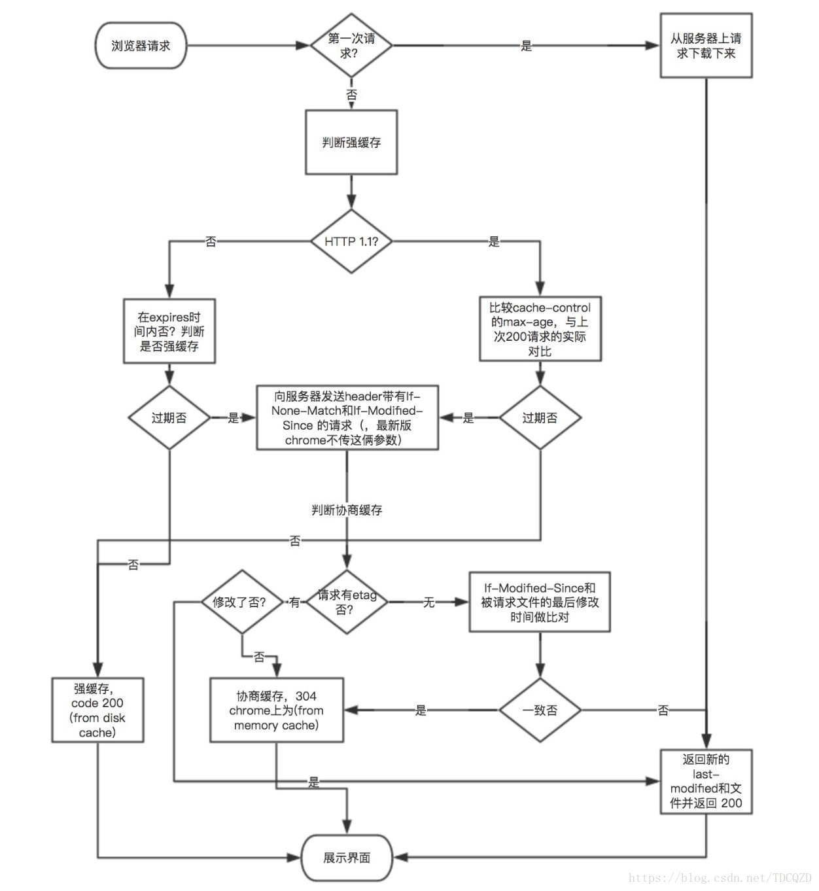

# 浏览器缓存机制

## 请求的3个步骤
1. 发出请求 ==> 缓存 ==>  不发请求
2. 后端处理请求
3. 浏览器响应请求 ==> 缓存 ==> 数据一样时不处理响应

## 缓存位置
缓存位置共有四种, 按优先级排序有
### 1.Server Worker
通过Service Worker监听缓存文件, 可以自由控制缓存哪些文件, 如何匹配/读取缓存.  
时效: 浏览器关闭时,缓存清空.

### 2. Memory Cache
体积小的文件,可以放到内存缓存.  
时效: tab标签关闭时, 缓存消失

### 3. Disk Cache
大文件/内存使用率高时, 放到硬盘缓存.  
时效: 根据Header字段控制缓存时效.

### 4. Push Cache
HTTP/2, 只在会话中存在, 会话结束后就释放缓存

## 缓存过程
根据是否需要客户端发送请求到服务端, 可以把缓存过程可以分为两部分, 强缓存和协商缓存.

### 强缓存
不需要发送请求到服务端, 直接使用缓存
实现方法:
1. Expires:  缓存过期时间, 在这个时间前都可以从缓存取数据
    - HTTP/1.0+
    - Expires=max-age + 请求时间, 受限于本地时间, 需要与Last-modified结合使用, 
    - 优先级低

2. Cache-Control 缓存控制设置
    - HTTP/1.1
    - 常用值: max-age(xx秒后过期) public(proxy也可以缓存), private(仅client), no-cache(转到协商缓存)
    - 优先级中

3. Pragma
    - HTTP/1.0
    - no-cache: 不直接使用缓存,根据新鲜度来使用缓存 在HTTP1.1中已经废除
    - 优先级高

### 协商缓存
需要发送带有缓存信息的请求到服务端, 确认是否使用缓存
实现方法:
1. `Last-Modified` 和 `If-Modified-Since`
    - HTTP/1.0
    - 通过发送文件的修改时间, 来对比是否有内容更新过
    - 以秒为单位不一定准确, 优先级低

2. `ETag` 和 `If-None-Match`
    - HTTP/1.1
    - 根据文件的HASH来判断是否有更新
    - 需要消耗运算性能, 优先级高
    - 服务端状态码304, 但是在network中仍然会显示200, 即看不出有变化(仅能观察req的if-none-match 和 res的 Etag)

## 流程图

## 常用策略
1. 频繁变动资源
> Cache-Control: no-cache  
每次都请求服务器, 配合ETag 或者 Last-Modified 来验证缓存资源是否有效

2. 不常变化的资源
> Cache-Control: max-age= 31536000  
在文件名上添加hash, 版本号等标记, 当文件需要更新时,通过更改url的方式"更新缓存".

## 踩坑
1. 假如无论怎么设置都无法缓存请求时, 可以检查chrome中是否勾选了 `Disable cache` 选项.

2. 使用 `ETag` 和 `If-None-Match`的时候, 留意状态码

    服务端状态码304, 但是在network中仍然会显示200, 即看不出有变化(仅能观察req的if-none-match 和 res的 Etag)

## 参考
- [深入理解浏览器的缓存机制](https://www.jianshu.com/p/54cc04190252)