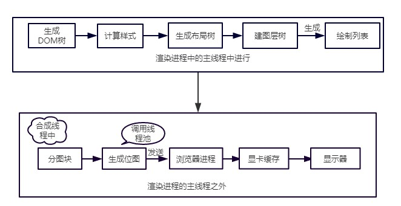
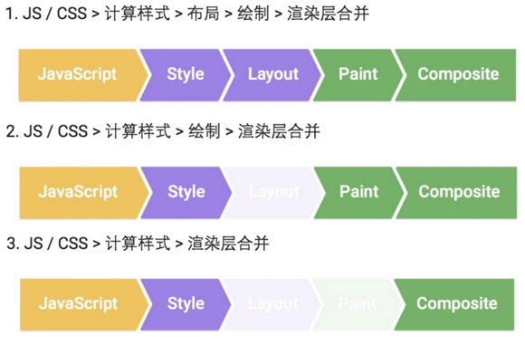

# 重排与重绘

浏览器的渲染流水线: 



## 什么是重排? 什么是重绘?  
浏览器下载完页面中的所有组件（HTML、JavaScript、CSS、图片）之后会解析生成两个内部数据结构（`DOM树`和`CSSOM树`），`DOM树`是HMTL代码中所有的标签，`CSSOM树`是仅含有样式信息的树。

结合这两棵树, 可以得到用于绘制画面的 `Render树`(渲染树).  
`渲染树`中每个节点都包含元素标签以及具体的样式信息.  
遍历`渲染树`中的节点, 计算它们的布局属性可以得到`布局树`.

    DOM树 + CSSOM树 = Render树(渲染树)

- `重排`是DOM元素的`几何属性变化`，`DOM树的结构变化`，渲染树需要重新计算。
- `重绘`是一个元素外观的改变所触发的浏览器行为，例如改变`visibility`、`outline`、`background-color`等属性。浏览器会根据元素的新属性重新绘制，使元素呈现新的外观。

集合流程图来看: 
1. 重排会触发整个流程工作
2. 重绘只影响`绘制` 和 `建图层树` 两个阶段
3. 重排必定引起重绘, 重绘不一定引起重排.

## 如何触发重排重绘
通过上面的概念, 可以知道 `重排` 是浏览器渲染过程中性能代价很高的一个环节.  
因为它需要重新计算渲染树的布局, 编写网页的时候为了尽量少的触发重排, 我们先来了解一下触发重排的几种情况.
### 触发重排的几种情况
1. 页面渲染初始化 ----- 无法避免
2. 浏览器窗口尺寸改变
3. 元素尺寸改变 ------- border, margin, padding, width, height
4. 元素位置改变 ------- top, left, position
5. 元素内容改变 ------- 文本改变, 图片大小改变引起的尺寸改变
6. 添加/删除在DOM树上的元素
7. 获取一些"计算属性"的时候(offsetTop, offsetWidth, scrollTop, clientTop)为了返回最新值.
8. window.getComputedStyle(dom) 方法

## 如何优化重排
针对上面的几种情况可以有以下优化方案:  
1. 改变样式时借助`className` 或 `cssText`  
    ```javascript
    // 主要思想: 将多次改变样式属性的操作合并成一次操作, 减少DOM访问. 
    const ele = document.getElementById('myDiv');

    // bad
    // ele.style.borderLeft = '1px';
    // ele.style.borderRight = '2px';
    // ele.style.padding = '5px';

    // good
    ele.className = 'active';
    ele.style.cssText = 'border-left: 1px; border-right: 2px; padding: 5px;';
    ```
2. fragment元素的应用  
   
        如果要批量操作DOM元素时, 可以先让父元素脱离文档流, 操作完以后再带入文档流. 

    常见的3种方式: 
    1. createDocumentFragment. 只触发一次

        ```javascript
        const fragment = document.createDocumentFragment();
        const li = document.createElement('li');
        li.innerHTML = 'apple';
        fragment.appendChild(li);
        document.getElementById('fruit').appendChild(fragment);
        ```
    2. display: none.  触发两次
    3. 先复制原节点(cloneNode), 操作完后, 再用替换节点(replaceChild). 只触发一次
   
3. 对需要重排的浏览器属性缓存
4. 让元素脱离动画流, 使用绝对定位脱离文档流
5. 对于 resize, scroll 等操作进行防抖/节流处理


## 如何优化重绘  

1. 把元素提升为合成层, 提升后的优点:  
   1. 启动GPU加速
   2. 有独立的层叠上下文, repaint的时候不会影响到其他层
   3. transform 和 opacity 不会触发 layout 和 paint
   4. 提升方法, style属性: will-change: transform;

## 题外话

### 浏览器的内部优化  
- `维护重排队列`  
浏览器会维护一个队列, 把所有会引起重排, 重绘的操作放到队列中, 等队列中的操作到达一定数量,或者一定时间间隔, 浏览器会清空队列, 进行一个批处理, 从而把原本的多次重排/重绘变成一次重排一次重绘.

### `浏览器资源的加载时机`   
1. css加载不会阻塞DOM树的解析, 但css加载会阻塞DOM树的渲染
2. css加载会阻塞后面js语句的`执行`
3. js加载会阻塞后面的DOM树的解析和渲染

结论:  

1. css放前面加载, 为了防止显示的样式跳动, 但是会延迟白屏时间
2. js标签最好放后面, 或者使用`defer`属性    